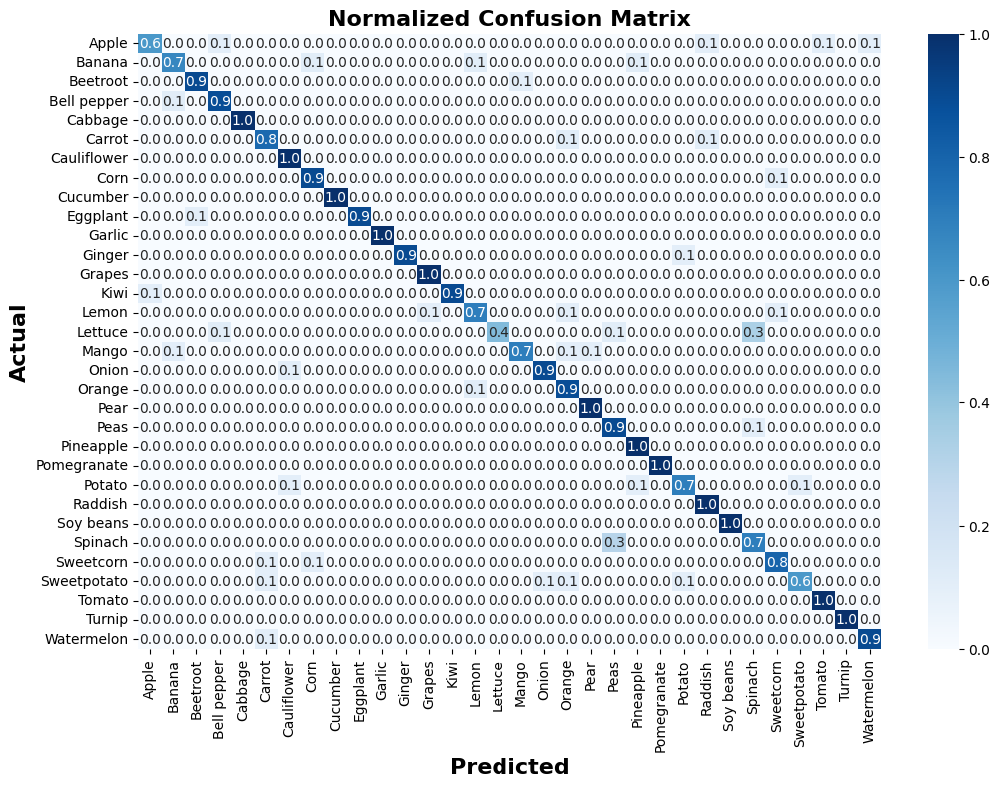

# 🍎🥦 Fruit and Vegetable Image Recognition Model  

## 📌 Project Overview  
This project builds a **custom Convolutional Neural Network (CNN)** to classify images of fruits and vegetables. The model is trained on a dataset containing **36 classes**, with 100 images or less per class.  

---

## 📊 Summary, Metrics & Optimizations  

### **📝 Model Summary**  

| Layer (type)   | Output Shape        | Param #   |
|---------------|--------------------|----------|
| Conv2d-1      | [-1, 32, 108, 108] | 2,432    |
| Conv2d-2      | [-1, 64, 104, 104] | 51,264   |
| MaxPool2d-3   | [-1, 64, 26, 26]   | 0        |
| Linear-4      | [-1, 128]          | 5,540,992 |
| Dropout-5     | [-1, 128]          | 0        |
| Linear-6      | [-1, 36]           | 4,644    |

Total Parameters: 5,599,332  
Trainable Parameters: 5,599,332  


### 📊 Model Performance Metrics  

| Metric                 | Value |
|------------------------|-------|
| **Validation Accuracy** | 91%   |
| **Test Accuracy**      | 89%   |
| **Best Model Epoch**   | 69    |
| **Precision**          | 0.906   |
| **Recall**             | 0.906    |
| **F1-Score**          | 0.906    |

 


### 🚀 Installation & Setup
``` git clone https://github.com/yourusername```

``` bash fruit-veg-classification.git```

``` bash cd fruit-veg-classification```

``` bash pip install -r requirements.txt```

## 🚀 Optimizations and Strategies  

To improve model performance and ensure efficient training, the following optimization techniques were applied:  

### 🔹 Data Augmentation  
- Applied **RandomResizedCrop(112, scale=(0.8, 1.0))** to introduce variability in training images.  
- Used **RandomHorizontalFlip(p=0.5)** to simulate real-world conditions.  
- Added **ColorJitter** to enhance color variations and improve generalization.  

### 🔹 Regularization Techniques  
- Implemented **Dropout (p=0.5)** in fully connected layers to reduce overfitting.  

### 🔹 Learning Rate Scheduling  
- Utilized **ReduceLROnPlateau** to **adjust the learning rate dynamically** based on validation loss.  
- If the validation loss did not improve for 4 epochs, the learning rate was **reduced by a factor of 0.5**, helping the model converge better.  

### 🔹 Early Stopping  
- **Monitored validation loss** and stopped training when performance stopped improving for **7 consecutive epochs**.  
- This helped **prevent overfitting** and **saved computational resources** by avoiding unnecessary training cycles.  

### 🔹 Model Architecture Improvements  
- Adjusted **kernel sizes and number of filters** to capture richer features.  
- Used **MaxPooling layers** to reduce spatial dimensions efficiently.  
- Experimented with different **activation functions** (ReLU, LeakyReLU).  

### 🔹 Loss Function & Optimization  
- Used **CrossEntropyLoss** as the loss function for multi-class classification.  
- Optimized with **SGD**, known for good generalistion. 

 

### 📈 Future Improvements  
- Experiment with **pretrained models** (e.g., ResNet, EfficientNet).  
- Implement **fine-tuning** on deeper architectures.  
- Try **advanced augmentation** methods like Mixup and Cutout.  
- Explore **hyperparameter tuning** using techniques like Grid Search or Bayesian Optimization.
- Consider deploying a database and an API to serve on any application.
- Consider a feedback and monitoring system.  
